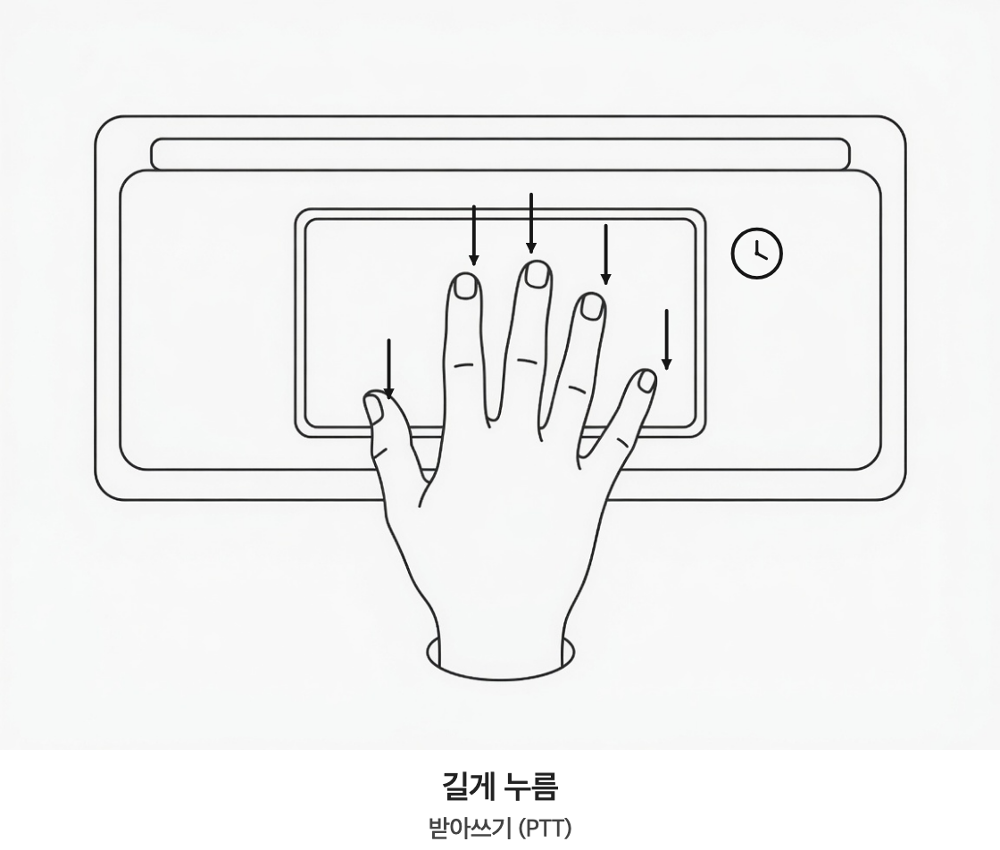
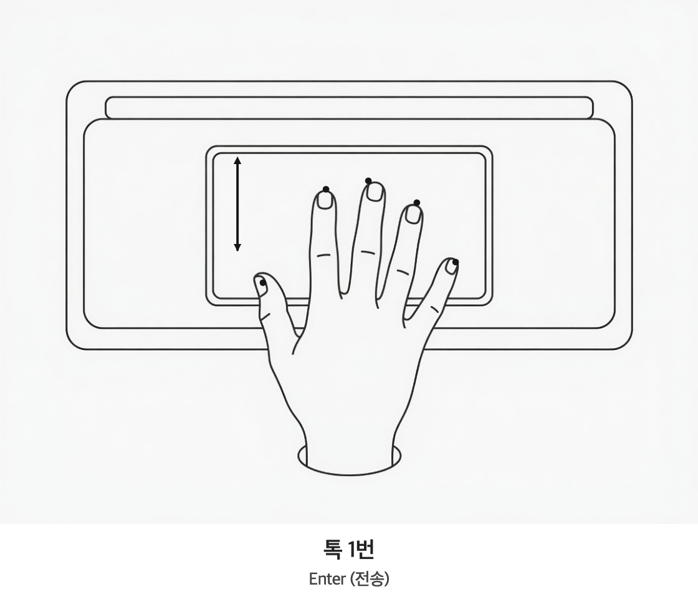
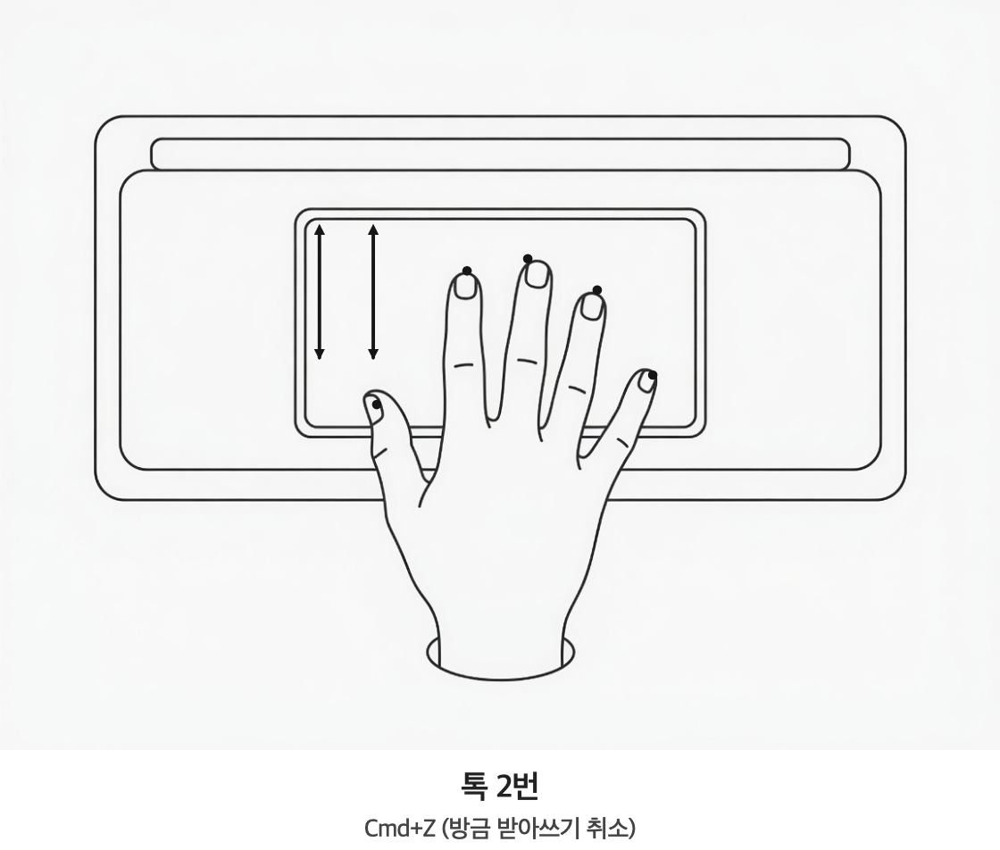

# Wisp

전부 로컬에서 도는 macOS 음성 입력 앱. 전역 단축키(⌃ Control 단독키) 또는
트랙패드 손가락 트리거 → 로컬 Whisper(large-v3-turbo, Metal) 전사 →
codex spark LLM 후처리 → 활성 앱에 자동 붙여넣기.

> 전사·후처리가 모두 사용자 머신에서 도는 **개인 프로젝트**다.

## 요구사항

- Apple Silicon Mac, macOS 14+
- Xcode Command Line Tools (Xcode 불필요)
- codex CLI — ChatGPT 플랜으로 `codex login`(인증 토큰은 codex가 사용자별로 관리하므로
  이 저장소엔 없다). `PATH`에 있으면 **자동 탐지**하고, 없으면 LLM 후처리 없이 받아쓰기만 동작

## 빌드

```bash
./scripts/build-whisper.sh        # 최초 1회: whisper.cpp 정적 빌드 (cmake 자동 설치)
./scripts/make-app.sh --install   # ~/Applications/Wisp.app 설치
open -a Wisp                      # 이후엔 이름만으로 실행 (Spotlight도 가능)
```

agent-bar와 동일한 빌드 방식이다: Xcode/개발자 인증서 없이 SwiftPM 빌드 →
수동 번들 조립 → ad-hoc 서명. `--install` 없이 실행하면 `build/Wisp.app`만 만든다.

첫 실행 시 마이크·손쉬운 사용 권한을 허용해야 한다. ad-hoc 서명 특성상 **재빌드
후 재설치하면 손쉬운 사용 권한을 시스템 설정에서 한 번 껐다 켜야 할 수 있다.**
Whisper 모델(1.5GB)은 앱 첫 실행 시 HuggingFace에서 자동 다운로드된다.

## 사용

- ⌃(Control) 짧게 탭: 녹음 토글 / 길게(0.4초+) 누른 채 말하기: push-to-talk
- ⌃ 조합키(⌃C 등)를 누르면 그 누름은 단축키로 치지 않는다 — 시작 직후면
  녹음 자동 취소, 토글 녹음 중이면 녹음 유지
- 트랙패드: 기본 꺼짐. 설정 → 단축키 → "트랙패드 손가락 트리거"를 켜면 됨
  (기본 5손가락, 3/4개로 변경 가능). 키보드 단축키와 같이 동작
- 지정한 손가락 수를 길게 누르면 받아쓰기(PTT, 떼면 종료). 트랙패드는 토글 없음
- 톡 1번: Enter(전송) / 톡 2번: ⌘Z(방금 받아쓰기 취소)

  <p>
  
  
  
  </p>
- 녹음 중 Esc: 취소
- 메뉴바에서 모드 전환 (받아쓰기 = LLM 없음 / 메시지 / 이메일)
- LLM 실패 시 STT 원문이 그대로 붙여넣어짐 (입력 무손실)
- 단축키 변경: `config.json`의 `hotkeyBareModifier`(control/option/command/shift,
  단독 보조키) 또는 null로 두고 `hotkeyKeyCode`+`hotkeyModifiers`(Carbon 콤보)
- 메뉴바 → "Wisp 열기…": 설정·단축키 레코더·모드 편집·히스토리 창 (Phase 3) —
  설정 변경은 재시작 없이 즉시 적용된다
- 녹음 중 시스템 동작(모드별): 재생 중 미디어 자동 일시정지/재개(기본), 음소거,
  볼륨 15% 낮춤 중 선택 (모드 패널 "녹음 중 오디오")
- 사운드 피드백(시작/완료 음)·자동 붙여넣기 토글·붙여넣기 후 클립보드 복원 (일반 패널)

## 개발

```bash
swift build              # 빌드
./scripts/test.sh        # 테스트 (자체 러너 — 이 환경엔 XCTest가 없음)
./scripts/test.sh 필터    # 이름 필터로 일부만
WISP_REAL_CODEX=1 ./scripts/test.sh CodexReal   # 실제 codex 통합 테스트 (옵트인)
```

codex 프로토콜 실측: `docs/codex/NOTES.md` · 스모크: `docs/checklists/`

## 라이선스

[MIT](LICENSE).

## 서드파티 / 크레딧

- [whisper.cpp](https://github.com/ggml-org/whisper.cpp) · [ggml](https://github.com/ggml-org/ggml) — MIT (로컬 STT 엔진, submodule. 컴파일된 라이브러리와 모델은 저장소에 포함하지 않고 빌드/실행 시 받는다)
- [Silero VAD](https://github.com/snakers4/silero-vad) (ggml 변환본 `ggml-org/whisper-vad`) — MIT (무음 환각 방지)
- Whisper `large-v3-turbo` 모델 — MIT (OpenAI/ggml. 저장소에 미포함 — 로컬 설치본 복사 또는 HuggingFace 다운로드)
- 미디어 "재생 중" 조회 기법 — [ungive/mediaremote-adapter](https://github.com/ungive/mediaremote-adapter)의 원리 참고(코드 미사용, `helpers/mr_probe.m`은 자체 구현)
